## 设计模式——[链接](https://refactoringguru.cn/design-patterns)

### 桥接(bridge)模式
- 开发跨平台的视频播放器，可以在不同操作系统(Mac, Windows, Linux)播放不同编码(avi, mp4...)的视频文件;
  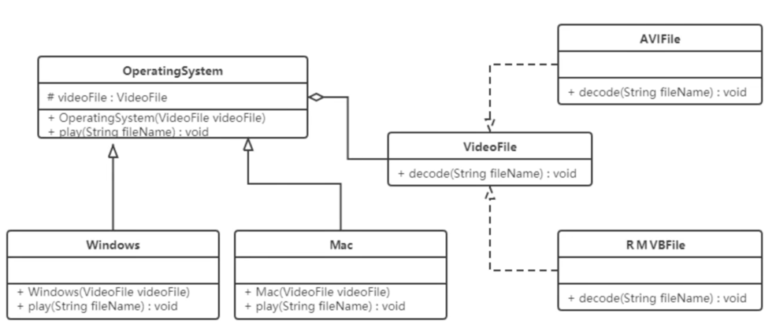
- 好处：
  - 提高系统可扩展性，在两个变化维度中任意扩展一个维度，不需要修改原有系统
  - 实现细节对客户透明
- 使用场景
  - 一个类存在两个独立变化的维度，且两个维度都需要进行扩展时
  - 一个系统不希望使用继承或因为多层次继承导致系统类的个数急剧增加
  - 一个系统需要在构建的抽象话角色和具体化角色之间增加更多的灵活性时，避免在两个层次之间建立静态的继承联系，通过桥接模式可以使它们在抽象层建立一个关联关系
    
### 外观(facade)模式
- 通过为多个复杂的子系统提供一个一致的接口，而使这些子系统更加容易被访问的模式。这种模式对外有一个统一接口，外部程序不用关心内部子类的具体实现细节，大大降低应用程序复杂度提高可维护性;
- 结构
 - 外观角色：为多个子系统提供接口
 - 子系统角色：实现系统功能

 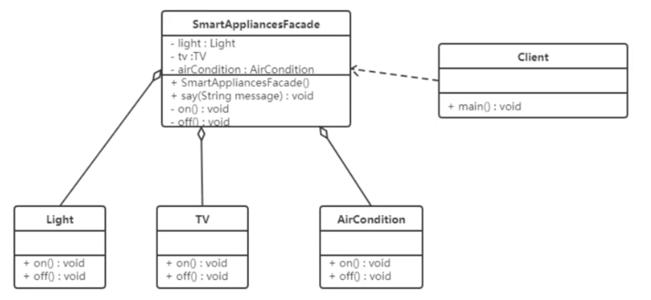
- 定义一个SmartAppliancesFacade来帮助人们进行开关灯、电视机、空调等。
- 好处
  - 降低子系统与客户之间耦合度，使得子系统的变化不会影响调用它的客户类
  - 对客户屏蔽了子系统组件，减少了客户处理的对象数目，并使得子系统使用起来更加容易。
- 缺点
  - 不符合开闭原则，修改麻烦。
- 使用场景
  - 对分层系统构建，简化每层入口点和子系统之间的依赖关系
  - 子系统复杂时，设计一个简单的接口供外界访问
  - 客户端与多个子系统存在很大联系时，外观模式将它们分离，提高子系统的独立性和可移植性。

### 组合(combination)模式
- 部分-整体模式，把一组相似对象当作单一对象，依据树形结构来组合对象，表示部分以及整体模式；
- 结构
  - 抽象根节点：各层次对象的共有方法和属性，如每一个文件夹下面有好多文件，文件夹就是抽象根节点；
  - 树枝节点：文件夹存储文件，树形结构中间的一些文件夹
 - 子节点：具体文件，不能再分。

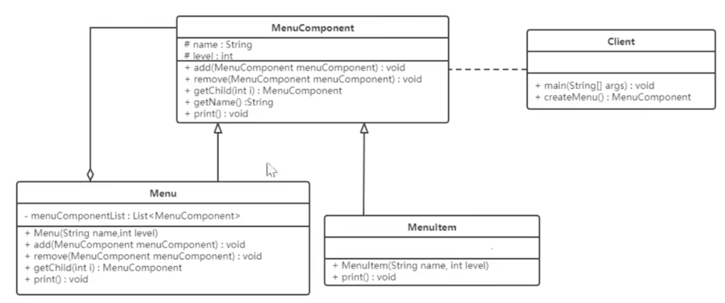
- 优点
  - 清楚定义分层次的复杂对象，方便对整个层次结构进行控制
  - 客户端可以一致使用一个组合结构或其中单个对象，不必关心处理的是单个还是整个组合结构，简化客户端代码
  - 增加树枝节点、叶子节点方便，“开闭原则”；
  - 为树形结构的面向对象实现提供一种灵活的解决方案，通过叶子节点和树枝节点的递归组合，可以形成复杂的树形结构。
- 使用场景
  - 出现在树形结构的地方，文件目录显示、多级目录呈现等树形结构的数据操作
- 分类
   - 透明组合模式：抽象根节点声明所有用于管理成员对象的方法，确保所有构件类都有相同的接口
   - 缺点：不够安全。
   - 安全组合模式：抽象根节点没有声明任何用于管理成员对象的方法，而是在树枝节点**Menu**类中声明并实现这些方法
   - 缺点：不够透明。

### 享元(Flyweight)模式
- 共享技术有效支持大量细粒度对象的复用，通过共享已经存在的对象来大幅度减少要创建的对象数量，避免大量相似对象的开销，从而提高系统资源的利用率。
- 状态
  - 内部状态：不随着环境改变而改变的共享部分
  - 外部状态：随环境改变而改变的不可以共享的部分，享元模式实现要领就是区分这两种状态，并将外部状态外部化。
- 角色
  - 抽象享元模式：接口抽象类，声明具体享元类公共的方法，这些方法可以向外界提供享元对象的内部数据，同时设置外部数据
  - 具体享元：实现抽象享元类，称为享元对象，在具体享元类中为内部状态提供类存储空间；
  - 非享元：并不是所有的享元类的子类都需要被共享，不能被共享的子类可设计为非共享具体享元类
  - 享元工厂：负责创建和管理享元角色。当客户请求一个享元对象时，享元工厂检查系统中是否存在符合要求的享元对象，如果存在则提供给客户，不存在则创建一个新的享元对象。

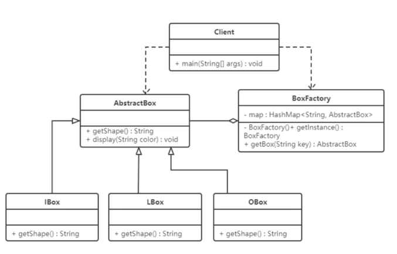
- 优点
  - 减少内存中相似或相同对象，节约系统资源，提供系统性能
  - 享元模式外部状态相对独立，且不影响内部状态
- 缺点
  - 为了使对象可以共享，需要将享元对象的部分状态外部化，分离内部状态和外部状态，使程序逻辑复杂
- 使用场景
  - 一个系统有大量相同或相似对象，造成资源浪费
  - 对象大部分都可以外部化，可以将这些外部状态传入对象中
  - 需要多次重复使用享元对象，有个存享元对象的池

## 行为行模式

### 模版方法模式
- 设计系统知道算法关键步骤，确定步骤执行顺序，但某些步骤具体实现还未知，或者某些步骤实现与具体环境相关；
- 结构
  - 抽象类：负责给算法的轮廓和骨架，由一个模版方法和若干个基本方法构成
  - 基本方法：实现算法步骤的方法，是模版方法的组成部分，由其具体子类实现
    - 抽象方法：一个抽象方法由抽象类声明，由具体子类实现
    - 具体方法：一个具体方法由一个抽象类或具体类声明并实现，其子类可以进行覆盖也可以直接继承
    - 钩子方法：在抽象类中已经实现，包括用于判断的逻辑方法和需要子类重写的空方法两种，一般钩子方法是用于判断的逻辑方法，这类方法名一般为isXxx，返回值为boolean类型
  - 具体子类：实现抽象类中所定义的抽象方法和钩子方法，它们是一个顶级逻辑的组成步骤； 

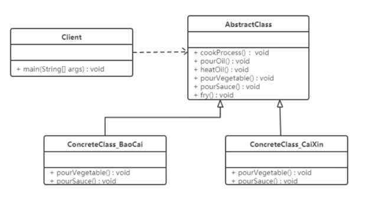
- 优点
  - 提高代码复用性，将相同的代码放在抽象的父类中，而将不同代码放入不同的子类中
  - 实现了反向控制，通过一个父类调用其子类实现，通过对子类的具体实现扩展不同的行为，实现了反向控制，符合“开闭原则”
- 缺点
  - 对每个不同对实现都需要定义一个子类，导致类个数增加，系统更加庞大
  - 父类中的抽象方法由子类实现，子类执行的结果会影响父类的结果，导致一种反向的控制结构，提高代码阅读难度
- 使用场景
  - 算法整体步骤稳定，其中个别部分易变时，将容易变化的抽象出来，供子类实现
  - 需要通过子类来决定某个步骤是否执行，实现子类对父类的反向控制

### 策略模式
- 定义一系列算法，将算法封装，是他们相互替换，算法变化不影响使用算法的客户，属于对象行为模式
- 结构
   - 抽象策略类：抽象角色，通常由一个接口或抽象类实现，给出所有的具体策略类所需的接口
   - 具体策略：实现抽象策略定义的接口，提供具体的算法实现或行为
   - 环境类：持有一个策略类的引用，最终给客户端调用

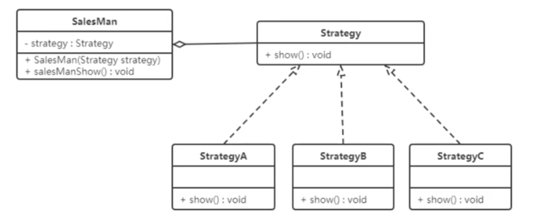
- 优点
   - 策略类之间可以自由切换
   - 易于扩展
   - 避免使用多重条件选择语句(if...else)，体现面向对象
- 缺点
   - 客户端必须知道所有的策略类，并自行决定使用哪一个策略类
   - 策略模式将造成产生很多策略类，可以通过使用享元模式在一定程度上减少对象的数量
- 使用场景
   - 一个系统需要动态在几种算法选择一种时， 可将每个算法封装到策略类中
   - 一个类定义多种行为，并且这些行为在这个类的操作中以多个条件语句出现，每个条件分支移入各自策略中
   - 系统中各种算法彼此完全独立，且要求对客户隐藏具体算法的实现细节
   - 系统要求使用算法的客户不应该知道操作的数据时，可使用策略模式隐藏与算法相关的数据结构
   - 多个类只区别在表现行为不同 

### 命令模式
- 将一个请求封装成一个对象，使发出请求的责任和执行请求的责任分割开，这样两者之间通过命令对象进行沟通，这样方便将命令对象进行存储、传递、调用、增加与管理
- 结构
   - 抽象命令类(Command)角色：定义命令接口，声明执行方法；
   - 具体命令(Concrete Command)角色：具体命令，实现命令接口；通常会持有接收者，并调用接收者的功能来完成命令要执行的操作；
   - 实现者(Receiver)角色：接收者，真正执行命令的对象；
   - 调用者(Invoker)角色：要求命令对象执行请求，通常会持有命令对象，可以持有很多命令对象。

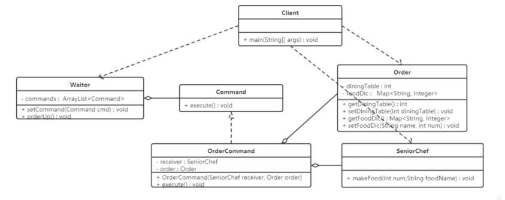
- 优点
   - 降低系统耦合度，调用操作的对象和实现该操作的对象耦合度
   - 增加或删除命令非常方便
   - 可以实现宏命令
   - 方便实现Undo 和 Redo 操作
- 缺点
   - 可能会导致系统有过多的具体命令类
   - 系统结构更加复杂

- 使用场景
   - 系统需要支持命令的撤销(Undo)操作和恢复(Redo)操作
   - 调用者和接收者耦合，不直接交互
   - 系统需要在不同的时间指定请求，将请求排队和执行请求。

### 责任链模式
- 为了避免请求发送者与多个请求处理者耦合在一起，将所有请求的处理者通过前一对象记住其下一个对象的引用而连成一条链；当有请求发生时，可将请求沿着这条链传递，直到有对象处理它为止。
- 结构
   - 抽象处理者(Handler)角色：定义一个处理接口，包含抽象处理方法和一个后继连接
   - 具体处理者(Concrete Handler)角色：实现抽象处理者的处理方法，判断能否处理本次请求，如果可以则处理，不可以将转给它的后继者
   - 客户类(Client)角色：创建处理链，并向链头的具体处理者对象提交请求，不关心处理细节和请求传递过程

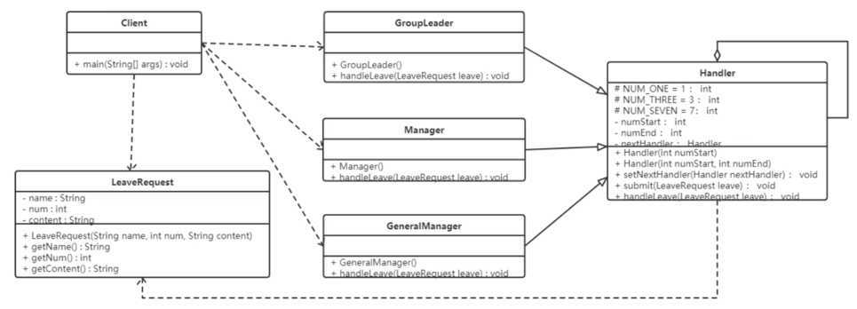
- 优点
   - 降低对象耦合度
   - 增强系统可扩展性
   - 增强给对象指派职责的灵活性
   - 简化对象之间的连接
   - 责任分担
- 缺点
   - 不能保证每个请求一定被处理，由于一个请求没有明确的接收者，所以不能保证它一定会被处理，可能传到链的末端都得不到处理
   - 对比较长责任链，请求的处理可能涉及多个处理对象，系统性能将受到一定影响
   - 责任链建立的合理性要靠客户端来保证，增加客户端的复杂性，可能会由于责任链的错误设置而导致系统出错，如循环调用

### 状态模式
- 对于有状态的对象，把复杂的“判断逻辑”提取到不同的状态对象中，允许状态对象在其内部状态发生改变时改变其行为；

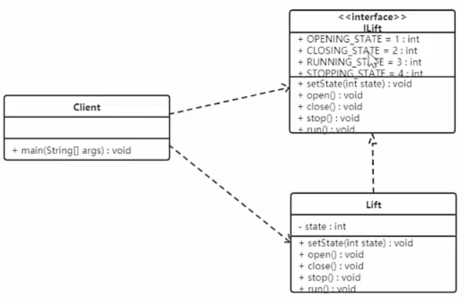

- 以上使用了大量是switch，现进行修改，类图如下：

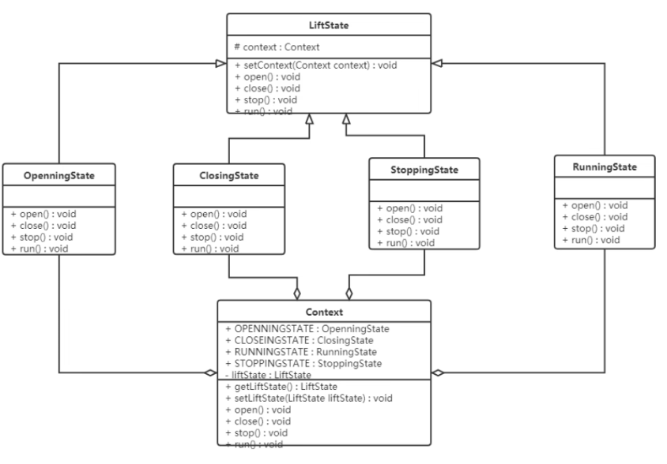
- 结构
   - 环境(Context)角色：也称上下文，定义了客户程序需要的接口，维护一个当前状态，并将与状态相关的操
作委托给当前状态对象来处理。
   - 抽象状态(State)角色：定义一个接口，用以封装环境对象中的特定状态所对应的行为
   - 具体状态(Concrete State)角色：实现抽象状态所对应的行为。

- 优点
   - 将所有与某个状态有关的行为放到一个类中，可很方便增加新的状态，只需要改变对象状态即可改变对象行为
   - 允许状态转换逻辑与状态对象合成一体，而不是某个巨大的条件语句块
- 缺点
   - 增加系统类和对象个数
   - 结构与实现较复杂，使用不当会导致程序结构和代码的混乱
   - 对“开闭原则”的支持不友好
- 使用场景
   - 一个对象的行为取决于它的状态并且它必须在运行时根据状态改变它的行为时，可以考虑状态模式
   - 一个操作有庞大的分支结构，并且这些分支决定于对象的状态时

### 观察者模式
- 发布-订阅模式，定义类一种一对多的依赖关系，让多个观察者同时监听某一个主题对象，这个主题对象在状态变化时会通知所有观察者对象，使他们能够自动更新自己。
- 结构
   - Subject：抽象被观察者，把所有观察者对象保存在一个集合里，每个主题都可以有任意数量的观察者，抽象主题提供一个接口，可以增加和删除观察者对象；
   - ConcreteSubject：具体主题，该角色将有关状态存入具体观察者对象，在具体主题的内部状态发生改变时，给所有注册过的观察者发通知；
   - Observer：抽象观察者，时观察者的抽象类，定义类一个更新接口，使得在得到主题更改通知时更新自己
   - ConcreteObserver：具体观察者，实现抽象观察者定义的更新接口，以便在得到主题更改通知时更新自身状态。

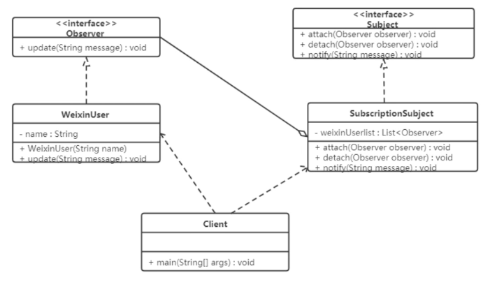
- 优点
   - 降低目标与观察者之间的耦合关系
   - 被观察者发送通知，所有注册的观察者都会收到消息
- 缺点
   - 如果观察者非常多，所有观察者收到被观察者发送的通知会耗时
   - 如果被观察者有循环依赖，那么被观察者发送通知会使观察者循环调用，导致系统崩溃
- 使用场景
   - 对象间存在一对多关系，一个对象的状态发生改变会影响其他对象
   - 当一个抽象模型有两个方面，其中一个方面依赖于另一方面时

### 中介者模式
- 将复杂的网状结构转换成星型结构，又叫调停模式，定义一个中介角色来封装一系列对象之间的交互，使原有对象之间的耦合松散，且可以独立地改变他们之间的交互。
- 结构
   - 抽象中介者(Mediator)角色：它是中介者的接口，提供同事对象注册与转发同事对象信息的抽象方法。
   - 具体中介者(ConcreteMediator)角色：实现中介者接口，定义一个List来管理同事对象，协调各个同事角色之间的交互关系，因此它依赖于同事角色
   - 抽象同事类(Colleague)角色：定义同事类的接口，保存中介者对象，提供同事对象交互的抽象方法，实现所有相互影响的同事类的公共功能
   - 具体同事类(Concrete Colleague)角色：是抽象同事类的实现者，当需要与其他同事对象交互时，由中介者对象负责后续的交互。

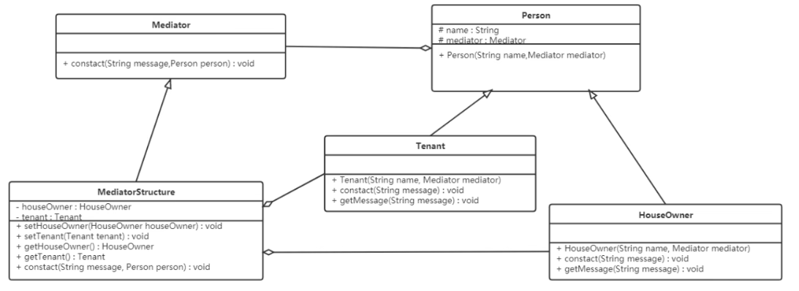
- 优点
   - 松散耦合，多个同事之间关联交互封装到中介者对象里面
   - 集中控制交互，多个同事对象交互，被封装在中介者对象里面集中管理，使得这些交互行为发生变化的时候，只需要修改中介者对象就可以了
   - 一对多关联转变为一对一的关联，没有使用中介者模式的时候，同事对象之间的关系通常是一对多，引入中介者对象以后，变成双向的的一对一。
- 缺点
   - 同事类太多，中介者职责将很大，变得复杂难以维护
- 使用场景
   - 系统中对象之间存在复杂的引用关系，系统结构混乱且难以理解
   - 想创建以一个运行多个类之间的对象，又不想生成新的子类时。

### 访问者模式
- 封装类一些作用于某种数据结构中的各元素的操作，它可以在不改变这个数据结构的前提下定义作用于这些元素的新的操作
- 结构
   - 抽象访问者(Visitor)角色：定义了对每一个元素(Element)访问的行为，它的参数可以访问的元素，它的方法个数理论上来讲与元素类个数是一样的；
   - 具体访问者(ConcreteVisitor)角色：给出对每一个元素类访问时所产生的具体行为
   - 抽象元素(Element)角色：定义一个接受访问者的方法(accept)，每一个元素都要可以被访问者访问
   - 具体元素(ConcreteElement)角色：提供接受访问的方法的具体实现，通常情况是使用访问者提供的访问该元素类的方法
   - 对象结构(Object Structure) 角色：定义当中所提到的对象结构，对象结构是一个抽象表述，具体点可以理解为一个具有容器性质或复合对象特性的类，含有一组元素(Element)，并且可以迭代这些元素，供访问者访问。

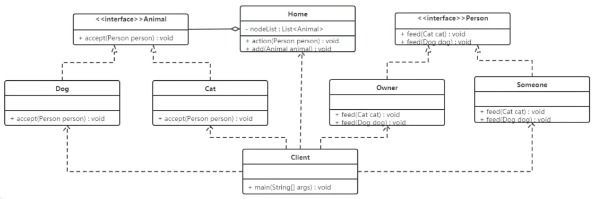
- 优点
   - 扩展性好，不改变对象元素情况下添加新的功能
   - 复用性好，定义整个对象结构通过功能
   - 分离无关行为，把相关行为封装在一起，构成一个访问者；
- 缺点
   - 对象结构变化困难
   - 违反类依赖倒置原则
- 使用场景
   - 对象结构相对稳定
   - 对象结构中的对象需要提供多种不同且不相关的操作，而且要避免让这些操作的变化影响对象的结构。

-
 
